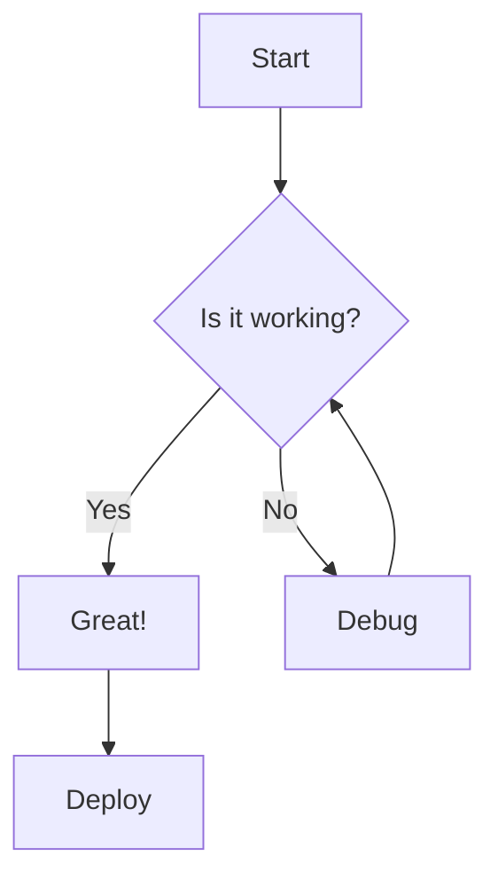
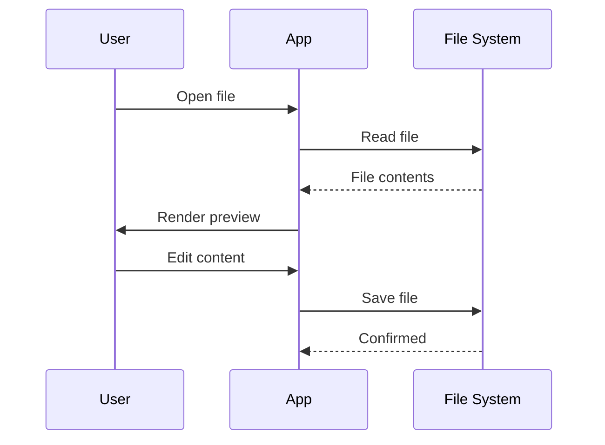

# Markd — Feature Demo

Welcome to the **Markd** feature demonstration document! This file exercises every major capability of the Markdown previewer. Open it in Markd to see everything in action.

---

## 1. Text Formatting

This paragraph demonstrates **bold text**, *italic text*, ~~strikethrough~~, `inline code`, and ==highlighted text==.

Here's some smart typography: "curly quotes" and 'single quotes', em-dashes---and en-dashes--plus ellipsis...

You can write H~2~O and x^2^ + y^2^ = z^2^ with subscript and superscript.

## 2. Links & References

- [External link](https://github.com) opens in your browser
- [[wiki-link]] demonstrates wiki-style internal linking
- Footnotes are supported too[^1] — check the bottom of the document[^2]

[^1]: This is the first footnote. It can contain **formatting** and `code`.
[^2]: This is a second footnote with a [link](https://example.com).

## 3. Lists & Tasks

### Unordered
- First item
- Second item
  - Nested item
  - Another nested
- Third item

### Ordered
1. Step one
2. Step two
   1. Sub-step A
   2. Sub-step B
3. Step three

### Task List
- [x] Completed task — click to toggle
- [ ] Pending task — click to toggle
- [x] Another done item

### Definition List
Markd
: A beautiful desktop Markdown editor with live preview

Electron
: Framework for building desktop apps with web technologies
: Created by GitHub in 2013

React
: A JavaScript library for building user interfaces

## 4. Code Blocks & Diff

### JavaScript
```javascript
function greet(name) {
  const message = `Hello, ${name}!`;
  console.log(message);
  return message;
}

greet('Markd User');
```

### Python
```python
import math

def fibonacci(n):
    """Generate first n Fibonacci numbers."""
    a, b = 0, 1
    for _ in range(n):
        print(a)
        a, b = b, a + b

fibonacci(10)
```

### Diff
```diff
- const oldValue = fetchFromLegacyAPI();
+ const newValue = await fetchFromModernAPI();
- processData(oldValue);
+ const result = await processDataAsync(newValue);
+ return result;
```

## 5. Tables

| Feature | Status | Priority |
|---------|--------|----------|
| Live Preview | ✅ Done | P0 |
| Search & Replace | ✅ Done | P1 |
| Mermaid Diagrams | ✅ Done | P2 |
| Export to PDF | 🚧 Planned | P3 |
| Mobile Support | ❌ Won't do | — |

## 6. Blockquotes

> This is a simple blockquote.
>
> It can span multiple paragraphs.

> **Tip:** Blockquotes work great with other formatting.
>
> - Nested list item
> - Another item
>
> ```js
> // Even code blocks!
> const answer = 42;
> ```

## 7. Math (LaTeX via KaTeX)

Inline math: $E = mc^2$ and the Pythagorean theorem $a^2 + b^2 = c^2$.

Block math:

$$
\frac{d}{dx}\left( \int_{a}^{x} f(t)\,dt \right) = f(x)
$$

The quadratic formula:

$$
x = \frac{-b \pm \sqrt{b^2 - 4ac}}{2a}
$$

Matrix:

$$
\begin{pmatrix}
1 & 2 & 3 \\
4 & 5 & 6 \\
7 & 8 & 9
\end{pmatrix}
$$

## 8. Emoji & Horizontal Rules

:rocket: :sparkles: :tada: Markd supports emoji shortcodes! :smile: :heart: :zap:

---

## 9. Mermaid Diagrams

### Flowchart


### Sequence Diagram


## 10. Admonitions / Callouts

:::note
This is a **note** callout. Use it for general information and helpful tips.
:::

:::tip
**Pro tip:** You can nest other Markdown inside callouts, like `code` and [links](https://example.com).
:::

:::warning
Be careful! This is a **warning** callout for things that need attention.
:::

:::danger
**Danger:** This is for critical warnings. Don't ignore these!
:::

---

## 11. Frontmatter

This document includes YAML frontmatter at the top (invisible in the preview). Markd parses it correctly and doesn't render it as content.

---

## 12. Raw HTML

<div align="center">
  <p><strong>This text is centered</strong> using raw HTML inside Markdown.</p>
</div>

<details>
<summary>Click to expand — HTML details/summary</summary>

This content is hidden by default and revealed when you click the summary.

You can include **Markdown** inside HTML blocks too.

</details>

---

*That covers all the major features of the Markd previewer. Happy writing!* :pencil:
